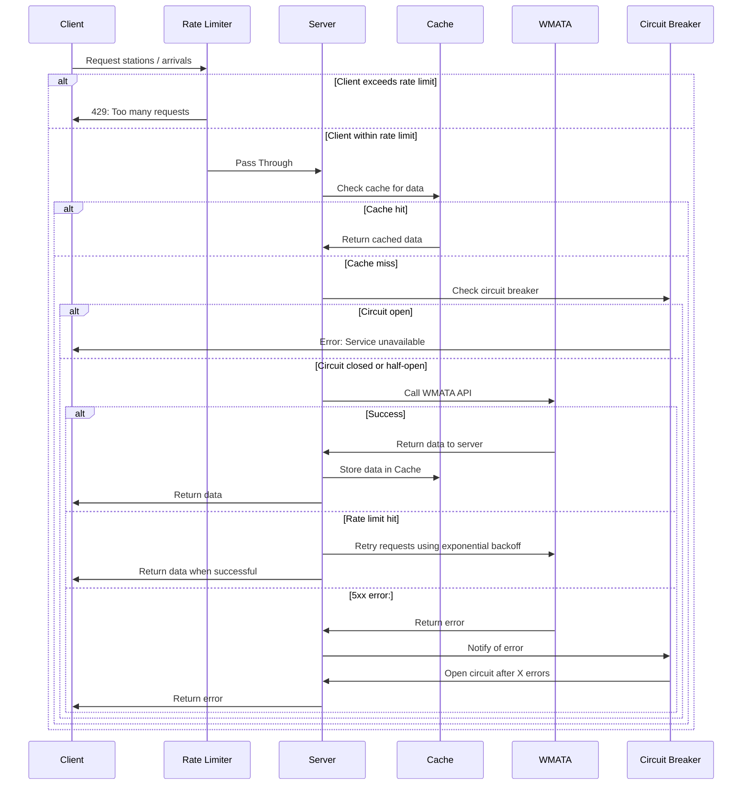

# DS Political WMATA Train Arrival Assignment

This project offers a first attempt at a full-stack system to allow passengers to consult the train arrival time of the Washington Metropolitan Area Transit Authority (WMATA)

## Local development

1. Run client

```shell
npm install
npm run dev
```

2. Copy `server/.env.example` to `server/.env`.
3. Replace value for `WMATA_API_KEY`
4. Run server

```shell
cd server
npm install
npm run dev
```

5. Open up http://localhost:5173 to see the client application.

## Docker

Add your `WMATA_API_KEY` to `compose.yaml` to build and run the Docker image.

However, even this should be removed. Secret environment variables can be added using [Docker buildkits](https://docs.docker.com/build/buildkit/)

```shell
docker compose build
docker compose up
```

Open up http://localhost:5173

## Sequence Diagram



## Service Interactions and Data Types

#### (A) Happy Path

1. User visits webpage
2. Client sends request to `SERVER_URL/api/v1/wmata/stations`
3. Server route is handled by `wmataController::getStations()`
4. Controller asks `wmataService::fetchStations()` for the station list
5. `fetchStation()` checks the cache to see if the result is already available. Alas, it is not.
6. `fetchStation()` checks whether the circuit breaker is closed and therefore if it is safe to make a request to `WMATA`. It is closed.
7. `fetchStations()` makes a request to the `/Rail.svc/json/jStations` endpoint. It returns successfully.
8. The success is recorded by the telemetry server.
9. The CircuitBreaker is informed of the successful communication.
10. `wmataModel` transforms the WMATA Stations data type (`Address`, `Code`, `Lat`, `LineCode1`, `LineCode2`, `LineCode3`, `LineCode4`, `Lon`, `Name`, `StationTogether1`, `StationTogether2`) into the data type needed to saturate the client UI (`name`, `lines`, `stationCodes`). `wmataModel` also filters out stations that are duplicated because they serve multiple lines.
11. Data returned by the server is used to hydrate the options in client's `StationPicker`. Each option displays the `name` of the station and the `lines` it belongs to. The `stationCodes` are used as the values of each option
12. When the selects a station from this chooser, client fires off a request to the `SERVER_URL/api/v1/wmata/arrivals/{stationCOde}`
13. Server route is handled by `wmataController::getArrivals()`
14. Controller asks `wmataService::fetchArrivals()` for the trains arriving at `stationCodes`
15. `fetchArrivals()` checks the cache and the circuit breaker as before
16. `fetchArrivals()` makes a request to the `/StationPrediction.svc/json/GetPrediction/{StationCodes}` endpoint. It returns successfully. Success is communicated to telemetry and the circuit breaker.
17. `wmataModel` transforms the WMATA Arrivals data type (`Car`, `Destination`, `DestinationCode`, `DestinationName`, `Group`, `Line`, `LocationCode`, `LocationName`, `Min`) into the data type needed to saturate the client UI (`destination`, `line`, `minutes`, `track`, `cars`).
18. Data returned by the server is used to hydrate the options in client's `ArrivalBoard`. Each listing displays the final `destination` of the train, the train `line`, the `track` it will arrive on, the number of `cars`, and the `minutes` to wait.

#### (B) Even happier path

Same as happy path but the cache returns data which the server can return to the client instead of repeating the query to the `WMATA` server

#### (C) Unhappy path

1. `WMATA` returns an error from the `/StationPrediction.svc/json/GetPrediction/{StationCodes}`
2. For certain types of errors (`408`, `429`, `5XX`) we will attempt to refetch from `WMATA` using exponential backoff or `Retry-After` header
3. A consistent pattern of errors will cause a circuit breaker to open. Once the circuit breaker is opened, we will prevent any requests from being sent to the `WMATA` endpoint. After a certain period of time, the circuit will become half-opened and we will allow a sample of requests to go through. After a consistent pattern of success, the circuit breaker will close again
4. The server will return an error to the client. The `ArrivalBoard` will receive a value of `true` for the `hasArrivalError` and will display an error message

#### (D) Cataclysmic Path

1. If `WMATA` returns an error from `SERVER_URL/api/v1/stations`, the client displays only a fallback error message.
   I would like to consult with the product and engineering team about the proper course of action. On the one hand, if we are having trouble just fetching the station list, then there might be a serious problem with `WMATA` so an error page might be appropriate. On the other hand, we might want to reconsider our way of accessing the station list. Right now we are getting this list by doing fetches from the `WMATA` server and we can only make a limited amount of fetches per minute and per day. So maybe fetching the station list from `WMATA` was a bad idea to begin with. Maybe these should be hard-coded in the frontend codebase or stored in some datastore that has no relation to `WMATA`. Maybe. But this would make our app unable to update the station list if certain stations became unavailable (as often happens on the `7` or `L` trains in NYC). The best solution is probably to retrieve the permanent station list from a source that is not `WMATA` but instead to fetch temporary station closures from them. Maybe. Let's think it through together.

## Rate limiting

On their default free tier, WMATA limits requests to 10 calls per second and 50,000 calls per day.

In order to respect these limits, we have added `rateLimiter` middleware to limit the frequency of access to our own server. We are also logging out `429` errors from `WMATA`.

We will also be pausing requests to WMATA. Using [axios-retry](https://github.com/softonic/axios-retry), we use the `Retry-After` header in the `429` response header to establish the minimum time we have to wait. We also use exponential backoff to retry other intermittent faiures.

Caching results from the API will allow us to return results from our own server rather than making requests to `WMATA`.

If none of these strategies are sufficient, we will need to negotiate with `WMATA` to purchase more access to their API.

## Error handling / Fault Tolerance

Middleware has been added to the service to handle errors as a centralized location to hande errors. Currently it is only being used send back responses to the client but its usage can be expanded.

Intermittent errors are always possible so we will want to retry certain types of failed requests (408, 429, 500+) using exponential backoff. This is easy to implement with [axios-retry](https://github.com/softonic/axios-retry).

Certain patterns of error might indicate a more severe problem that would require us to halt traffic in order to avoid further propagating errors. For this purpose, we are using [opossum](https://github.com/nodeshift/opossum) to implement a circuit breaker. A circuit breaker will temporarily block requests to the `WMATA` API. If we notice a consistent pattern of errors, we will open the circuit to prevent traffic. After some time, we will test the circuit by allowing sporadic requests do go through. If we observe a consistent pattern of success, we will close the circuit. If we do have to block requests to `WMATA`, we will indicate on our customer-facing UI that train arrival times are currently unavailable.

We are using [opentelemetry](https://opentelemetry.io/) to produce telemetry for such errors. We want to add a telemetry provider such as Datadog that would alert us when errors become too frequent so that we can immediately implement mitigation efforts. Because telemetry is not currently connected to a real provider, we are now seeing noisy log messages in the server console.

Using [pino-http](https://github.com/pinojs/pino-http), we are logging out errors. We want to configure this to work with a permanent datalake for doing so. Keeping log files will help us diagnose such service failures and to retrospectively analyze historical data for any patterns.

## Caching

The station list and the arrival times can both be cached for better performance

We would expect that the station list will be generally stable for months if not years. However, service disruptions can occur for a variety of reasons, from planned construction to unexpected accidents. To account for this, we are caching the station list for six hours. Six hours seems reasonable because the cache will go stale overnight when no trains are running. The first fetch of the morning will then renew the data.

Arrival times are measured in minutes so we require a shorter cache interval. We need to balance between avoiding overfetching and keeping our arrival times up to date. In particular, we don't want passengers to think a train is arriving or boarding if it has already left the station. To balance between these concerns, we are setting the cache time to 20 seconds.

These cache times may need to be adjusted. If we establish a reliable channel with `WMATA` for learning about system disruptions, we may be able to lengthen or perhaps even eliminate stations caching. If rate limits are a real concern, then we shouldn't even bother with requesting or re-requesting data about stations at all. The list of stations should remain mostly stable.

If we are getting complaints from people annoyed that "Arriving" trains have already left the station, we may shorten the arrival cache. If we receive precise information through a webhook from `WMATA` about the time trains leave the station, we may be able to lengthen the arrival cache or perhaps even replace it with an internal method of updating the clock.

Most important, if we are consistently pushing beyond our rate limits, we would definitely need to lengthen our cache times or otherwise revisit the way we update our data.

Currently we are using a simple npm library `memory-cache` for caching. In a real production environment, we would use a more robust product such as Redis or Memcached

## Testing

To test this code we will use standard testing tools to do snapshot testing such as Storybook, unit/integration testing such as Jest or React Testing Library and end-to-end testing such as Playwright or Cypress/Selenium.

#### Client testing

- Use a mock API to simulate server
- `ArrivalBoard.tsx`: Verify that it renders correctly for different inputs of `arrivals` and `hasArrivalError` props.
- `StationPicker.tsx`: Verify that it renders correctly for input of `stations` props.
- `App.tsx`: Verify that `StationPicker` and `ArrivalBoard` render
- Verify that front end displays correctly when it receives successful response from mock API
- Verify that error message displays when Mock API returns an error
- Verify that `onStationChange` function is invoked when a different station is picked in `StationPicker`.
- Verify that `ArrivalBoard` changes when station changes

#### Server Testing

- Use a mock API to simulate WMATA Service
- ROUTES: Verify that routes for `/api/v1/wmata/stations` and `/api/v1/wmata/arrivals/{stationCode}` are available and that they invoke their corresponding controllers
- CONTROLLERS: Verify that `getStations()` controller returns a `200` status and stations json when it receives a successful result from `fetchStation()` service. Verify that it passes an error to the errorHandler middleware when an error is returned
- CONTROLLERS: Verify that `getArrivals()` controller returns a `200` status and arrivals when it receives a successful result from `fetchArrivals` service. Verify that it passes an error to `errorHandler` middleware when an error is returned. Verify that it returns a 400 response when the `stationCodes` is not properly formatted. NOTE: This last error should also be passed to the `errorHandler` middleware.
- SERVICES: Verify that `cacheService` returns a cache object
- SERVICES: Verify that in `wmataService`, both `fetchStations()` and `fetchArrivals` call `cache.get`. Verify that they return the cached value if it there is one. If not, verify that they return the result on successful responses from mock API. Verify that they call `cache.put` with this result. Verify that they log errors and throw the on an unsuccessful responses
- MODEL: Make sure that `arrivalMapper` correctly maps different `WmataArrival`s to `DspArrival`: destination, line, minutes, track can all vary. Test that `stationMapper` correctly maps different `WmataStation`s to `DspStation`: lines and station codes can vary. Make sure that `allStationsMapper` correctly filters out stations that are listed twice because they serve multiple lines.
- MIDDLEWARE: Make sure that `rateLimiter` returns correctly configured object
- MIDDLEWARE: Make sure that `errorHandler` returns the correct responses for each type of error.

#### Integration Testing

Using a Mock API for the `WMATA` server, test the interactions between the client and the server

- Happy:

1. Opens up client page
2. Verifies list of stations
3. Clicks on station
4. Verifies list of arrivals
5. Clicks on different station
6. Verifies different arrivals

- Unhappy arrival

1. Same as above but arrival returns an error
2. Verify that error message is shown

- Unhappy stations

1. The station list can not be fetched! Or some other global error in the `WMATA` API
2. Verify that a fallback error is displayed

#### Fault Tolerance / Rate Limiting testing

Ideally we would want to test whether our mitigation efforts for fault tolerance and rate limiting are being successfully executed. Tests (1) and (2) are simple to write. Tests (3) and (4) are much more difficult. Because we are using well-tested `npm` libraries to implement these features, we probably don't need to test them ourselves

1. Verify that these events are being logged
2. Verify that telemetry callbacks are being invoked
3. Verify that exponential backoff is being correctly used
4. Verify that circuit breakers close, half-open, and fully open
